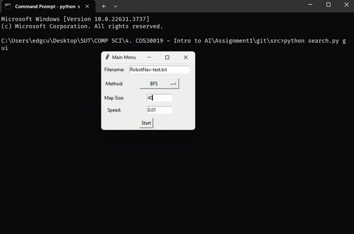

# Information
Searching Simulator

## Usage
```bash
python search.py gui
```

Example Input File
```txt
[5,11]
(0,1)
(7,0) | (10,3)
(2,0,2,2)
(8,0,1,2)
(10,0,1,1)
(2,3,1,2)
(3,4,3,1)
(9,3,1,1)
(8,4,2,1)

Note:
Line 1: [rows, columns]
Line 2 - start position: (row, column)
Line 3 - goal positions: (row, column) | (row, column)
From line 4 - obstacle: (row, column, width, height)
```

## Demo


## Authors
Chi Cuong Nguyen

## Searching Algorithms
- Breadth First Search
- Depth First Search
- A* Search
- Greedy Best First Search
- Bidirectional Search
- Beam Search
